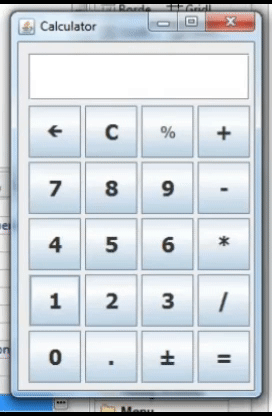

# GUI-Calculator
A GUI Calculator with all basic operations like addition, subtraction, multiplication, division,etc using Java Eclipse.

## Pre-requisite
- Java Window Builder
  - WindowBuilder is composed of SWT Designer and Swing Designer and makes it very easy to create Java GUI applications
  - To Install Window Builder to your eclipse: 
    - Open Eclipse -> Goto Help -> Eclipse Marketplace -> Search WindowBuilder -> Install Now.

## Features
- Arithmetic Operations like addition, subtraction, multiplication, division, modulus
- Backspace and clear screen function
- Conversion of number from positive to negative and vice versa

## Demo

